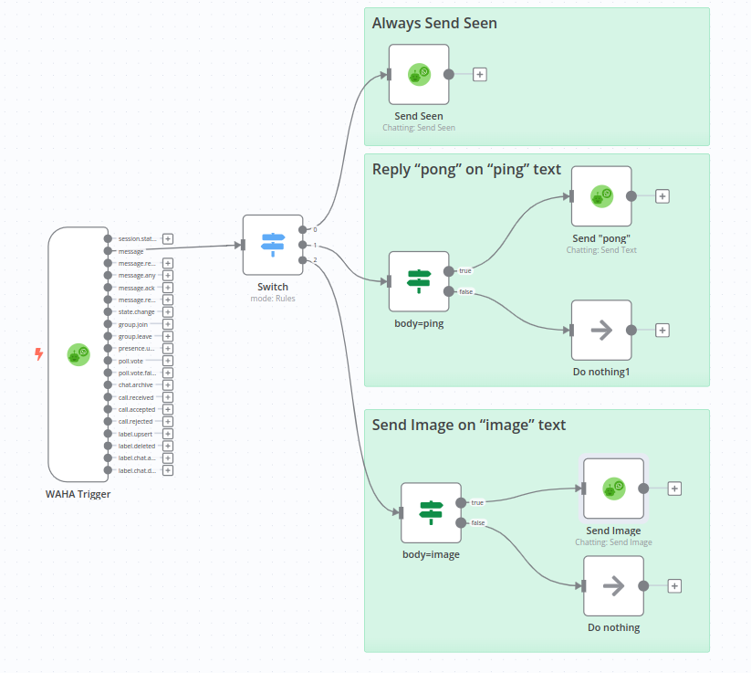
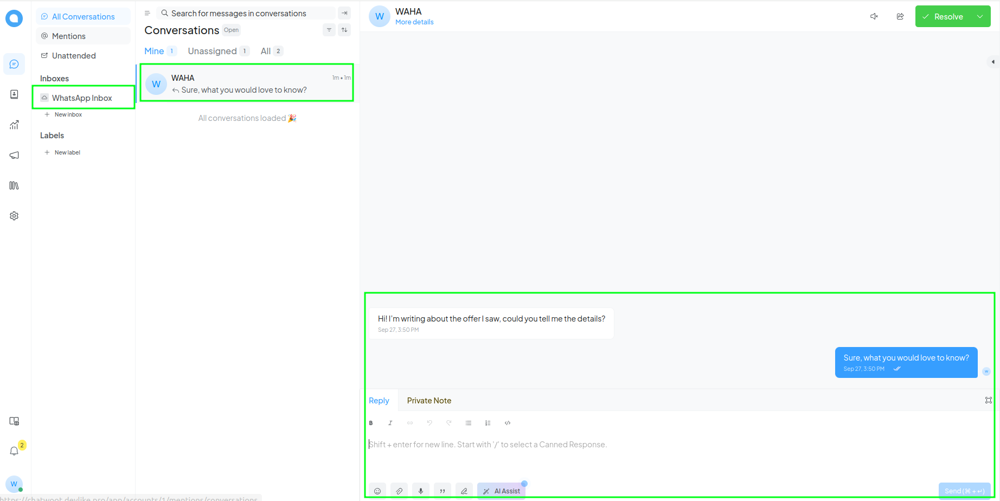
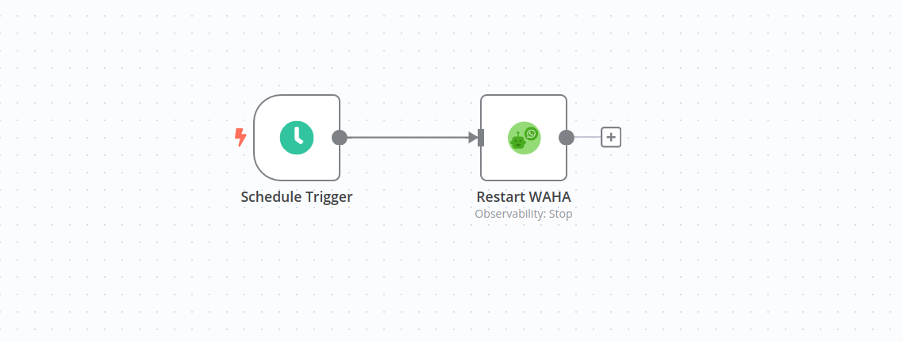

# WAHA n8n Workflow Templates

  

Templates for [WAHA - WhatsApp HTTP API](https://waha.devlike.pro) and [n8n](https://n8n.io/) workflows using
[@devlikeapro/n8n-nodes-waha](https://github.com/devlikeapro/n8n-nodes-waha)
node.

- [**WAHA + n8n: No Code Low Code WhatsApp Automation Step-By-Step Guide**](https://waha.devlike.pro/blog/waha-n8n/)
- [**🧩 WAHA + n8n Integration**](https://waha.devlike.pro/docs/integrations/n8n/)

# How to use the templates

1. Go to your **n8n** with installed **@devlikeapro/n8n-nodes-waha** node.
2. **Add new workflow**
3. Import one of the **templates** with either:
    1. **Copy & Paste** the template JSON
    2. **Import from URL** and paste the URL of the template JSON
4. Follow the **Set up steps** in the template README
5. Adjust the workflow to your needs

# Workflows Templates

<!-- toc -->

  * [WhatsApp Bot](#whatsapp-bot)
  * [WhatsApp Typebot Integration](#whatsapp-typebot-integration)
  * [WhatsApp Chatwoot Integration](#whatsapp-chatwoot-integration)
  * [Send WhatsApp QR code for authorization to Email](#send-whatsapp-qr-code-for-authorization-to-email)
  * [Send Bulk Messages API](#send-bulk-messages-api)
  * [Forward WhatsApp text messages to email](#forward-whatsapp-text-messages-to-email)
  * [Fetch image, Rotate and Send it back](#fetch-image-rotate-and-send-it-back)
  * [Send custom HTTP request to WAHA API](#send-custom-http-request-to-waha-api)
  * [Restart server at midnight](#restart-server-at-midnight)
  * [WAHA Trigger Explanation](#waha-trigger-explanation)
- [Contribute](#contribute)

<!-- tocstop -->

## WhatsApp Bot

    

Simple WhatsApp Bot template that replies with **"pong"** if received **"ping"** and sends Image if received
**"image"**.

[**Read more ->**](./chatting-template)

## WhatsApp Typebot Integration

    
    

Integrate [Typebot](https://typebot.io/) with [Self-Hosted WhatsApp API (WAHA)](https://waha.devlike.pro) to send
messages to WhatsApp via [n8n](https://n8n.io/).

[**Read more ->**](./whatsapp-typebot)

## WhatsApp Chatwoot Integration

    

You can integrate
[WAHA](https://waha.devlike.pro)
with
[ChatWoot](https://www.chatwoot.com/)
to receive and send messages to WhatsApp via n8n.

[**Read more ->**](./chatwoot)

## Send WhatsApp QR code for authorization to Email

    

Send **QR code** to **Email** when session it's in `SCAN_QR_CODE` status.

[**Read more ->**](./send-qr-code-to-email)

## Send Bulk Messages API

    

Forward all WhatsApp incoming text messages to the Email.

[**Read more ->**](./send-bulk-messages)

## Forward WhatsApp text messages to email

    

Forward all WhatsApp incoming text messages to the Email.

[**Read more ->**](./forward-all-text-messages-to-email)

## Fetch image, Rotate and Send it back

    

[**Read more ->**](./fetch-image-rotate-and-send-it-back)

## Send custom HTTP request to WAHA API

    

Template how to send custom HTTP request to WAHA API. It sends video message on incoming message with text "video".

[**Read more ->**](./send-custom-http-request-to-waha)

## Restart server at midnight

    

Restart server at midnight.

[**Read more ->**](./restart-server-at-midnight)

## WAHA Trigger Explanation

    

Explanation of **WAHA Trigger** node

[**Read more ->**](./waha-trigger-explanation)

# Contribute

Have an idea or looking for a new template?
Feel free to create new [**Issue** or **PR**](https://github.com/devlikeapro/waha-n8n-templates/pulls) 🙏

