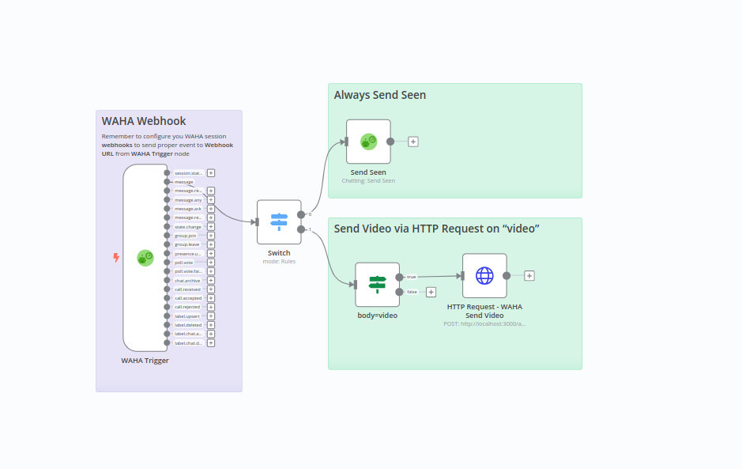

# WAHA n8n Workflow Templates

  

Templates for [WAHA - WhatsApp HTTP API](https://waha.devlike.pro) and [n8n](https://n8n.io/) workflows using
[@devlikeapro/n8n-nodes-waha](https://github.com/devlikeapro/n8n-nodes-waha)
node.

- [**WAHA + n8n: No Code Low Code WhatsApp Automation Step-By-Step Guide**](https://waha.devlike.pro/blog/waha-n8n/)
- [**🧩 WAHA + n8n Integration**](https://waha.devlike.pro/docs/integrations/n8n/)

<!-- toc -->

- [How to use the templates](#how-to-use-the-templates)
- [Workflows Templates](#workflows-templates)
  * [WhatsApp Bot](#whatsapp-bot)
  * [Send WhatsApp QR code for authorization to Email](#send-whatsapp-qr-code-for-authorization-to-email)
  * [Forward WhatsApp text messages to email](#forward-whatsapp-text-messages-to-email)
  * [Fetch image, Rotate and Send it back](#fetch-image-rotate-and-send-it-back)
  * [Send custom HTTP request to WAHA API](#send-custom-http-request-to-waha-api)
  * [Other Templates](#other-templates)
- [Contribute](#contribute)

<!-- tocstop -->

# How to use the templates
1. Go to your **n8n** with installed **@devlikeapro/n8n-nodes-waha** node.
2. **Add new workflow**
3. Import one of the **templates** with either:
    1. **Copy & Paste** the template JSON
    2. **Import from URL** and paste the URL of the template JSON
4. Follow the **Set up steps** in the template README
5. Adjust the workflow to your needs

# Workflows Templates

## [WhatsApp Bot](/chatting-template)

    

Simple WhatsApp Bot template that replies with **"pong"** if received **"ping"** and sends Image if received
**"image"**.

## [Send WhatsApp QR code for authorization to Email](./send-qr-code-to-email)

    

Send **QR code** to **Email** when session it's in `SCAN_QR_CODE` status.

## [Forward WhatsApp text messages to email](./forward-all-text-messages-to-email)

    

Forward all WhatsApp incoming text messages to the Email.

## [Fetch image, Rotate and Send it back](./fetch-image-rotate-and-send-it-back)

    

## [Send custom HTTP request to WAHA API](./send-custom-http-request-to-waha)

    

Template how to send custom HTTP request to WAHA API. It sends video message on incoming message with text "video".

## Other Templates
- [Restart server at midnight](./restart-server-at-midnight) - Restart server at midnight
- [WAHA Trigger Explanation](./waha-trigger-explanation) - Explanation of **WAHA Trigger** node

# Contribute

Have an idea or looking for a new template?
Feel free to create new [**Issue** or **PR**](https://github.com/devlikeapro/waha-n8n-templates/pulls) 🙏

