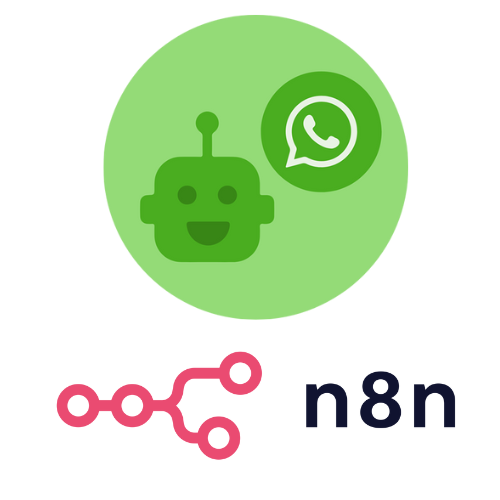

# WAHA n8n Templates Gallery

  

Templates for [WAHA - WhatsApp HTTP API](https://waha.devlike.pro) and [n8n](https://n8n.io/) workflows using
[@devlikeapro/n8n-nodes-waha](https://github.com/devlikeapro/n8n-nodes-waha) 
node.

- [**WAHA + n8n: No Code Low Code WhatsApp Automation Step-By-Step Guide**](http://localhost:1313/blog/waha-n8n/#install-waha-n8n-node)
- [**🧩 WAHA + n8n Integration**](https://waha.devlike.pro/docs/integrations/n8n/)

<!-- toc -->

- [How to use the templates](#how-to-use-the-templates)
- [Workflows Templates](#workflows-templates)
  * [Chatting Template](#chatting-template)
  * [Send QR code for authorization to Email](#send-qr-code-for-authorization-to-email)
  * [Other](#other)
- [Contribute](#contribute)

<!-- tocstop -->

# How to use the templates

You can import the workflows:
1. Go to your **n8n** with installed **@devlikeapro/n8n-nodes-waha** node.
2. **Add new workflow** 
3. Import one of the **templates** with either:
   1. **Copy & Paste** the template JSON
   2. **Import from URL** and paste the URL of the template JSON
4. Follow the **Set up steps** in the template README

# Workflows Templates

## [Chatting Template](/chatting-template)

Simple WhatsApp Bot template that replies with **"pong"** if received **"ping"** and sends Image if received **"image"**.

## [Send QR code for authorization to Email](./send-qr-code-to-email)

Send **QR code** to **Email** when session it's in `SCAN_QR_CODE` status.

## Other
- [Forward text messages from WhatsApp to Email](./forward-all-text-messages-to-email) - Receive and forward all text messages from WhatsApp to Email
- [Send Custom HTTP Request to WAHA API](./send-custom-http-request-to-waha)  - Example how to send custom HTTP request to WAHA API
- [Restart server at midnight](./restart-server-at-midnight) - Restart server at midnight
- [WAHA Trigger Explanation](./waha-trigger-explanation) - Explanation of **WAHA Trigger** node

# Contribute

Have an idea or looking for a new template? 
Feel free to create new [**Issue** or **PR**](https://github.com/devlikeapro/waha-n8n-templates/pulls) 🙏

