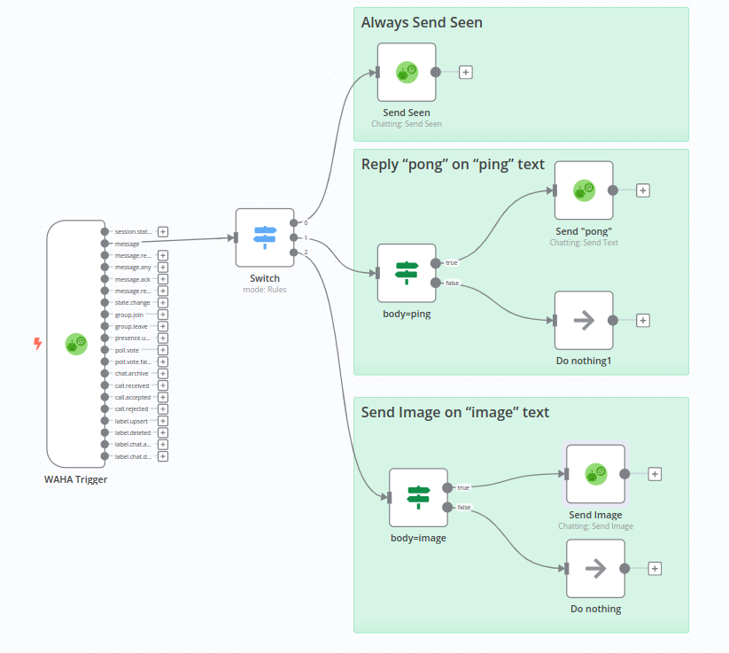

[<- Back](/)

# WhatsApp Bot Template
[**template.json**](./template.json)

Simple chatting template that replies with "pong" if received "ping" and sends an image if received "image".

## How it works
When receive a new message on WhatsApp session - **send seen** always and based on message:
- **Send back "pong"** if message is **"ping"**
- **Send back an image** if message is **"image"**

## Set up steps
- **Copy** template and **Paste** in n8n (Ctrl+V), or **Import From URL** 
- Configure **WAHA API** credentials and select it for all WAHA nodes
- Get **Webhook URL** (production one) from **WAHA Trigger** node
- Configure your **WAHA session** to send webhooks with `message` type to the **Webhook URL**
- **Active** your workflow in n8n
- Send "image" or "ping" to the WhatsApp account from another one and see the magic!
