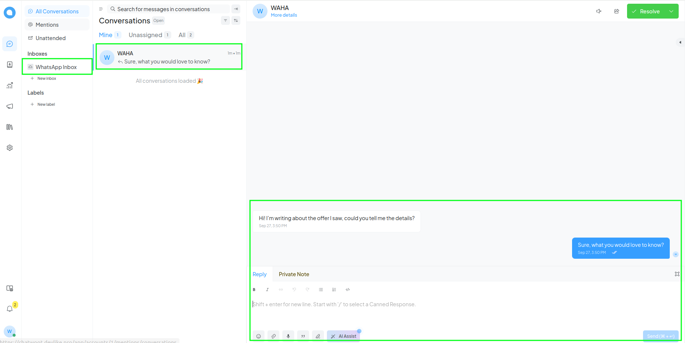
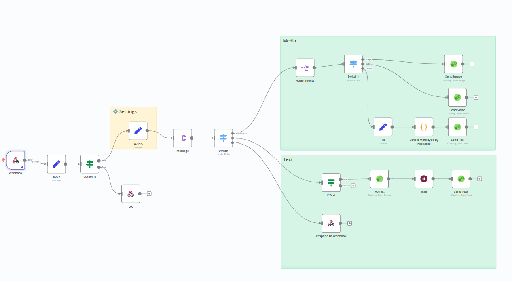
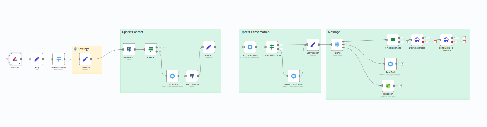

[<- Back](/)

# ChatWoot WhatsApp Integration

You can integrate 
[WAHA](https://waha.devlike.pro)
with
[ChatWoot](https://www.chatwoot.com/)
to receive and send messages to WhatsApp via n8n.

# How it works
**n8n** receives messages from **ChatWoot** and sends them to **WhatsApp** via **WAHA**.
And opposite, **n8n** receives messages from **WhatsApp** via **WAHA** and sends them to **ChatWoot**.

For that you need to have few templates and set up steps, follow the guide below.

## Why not built-in ChatWoot WhatsApp integration?
Every company has its own requirements and needs. 
This template allows you to customize the integration to your needs, 
to your specific use case, and to your specific customer support workflow.

# Set up steps

## 1. Database Migration
[**template.json**](./WhatsApp___ChatWoot__Database_Migrations.json)

1. Import [template.json](./WhatsApp___ChatWoot__Database_Migrations.json) to **n8n**
2. Configure **Posgres** nodes with your Postgres credentials
3. Run **Migration** block to create the necessary tables

## 2. ChatWoot => WAHA

[**template.json**](./WhatsApp___ChatWoot__ChatWoot____WAHA_Messages.json)

The workflow **receives** messages from ChatWoot and sends them to WhatsApp via WAHA.
1. Import [template.json](./WhatsApp___ChatWoot__ChatWoot____WAHA_Messages.json) to **n8n**
2. Configure **WAHA** settings with your session
3. Set all **WAHA** nodes with your **WAHA** credentials
4. **Active** your workflow in n8n
5. Copy **Production URL** from **Webhook** node
6. Go to **ChatWoot** and create new **API** **Inbox** and set **Webhook URL** from **n8n**
7. Send a message from **ChatWoot** to see it in **WhatsApp**

## 3. WAHA => ChatWoot

[**template.json**](./WhatsApp___ChatWoot__WAHA____ChatWoot_Messages.json)

The workflow **receives** messages from WhatsApp via WAHA and sends them to ChatWoot.
1. Get from the **Inbox** settings and **ChatWoot** settings:
   1. **Account ID**
   2. **Inbox ID**
   3. **Inbox Identifier**
   4. **ChatWoot URL**
2. Import [template.json](./WhatsApp___ChatWoot__WAHA____ChatWoot_Messages.json) to **n8n**
3. Set settings from **ChatWoot** in the workflow
4. Set all **Postgres** nodes with your Postgres credentials
5. Set all **ChatWoot** nodes with your **ChatWoot** credentials
6. **Active** your workflow in n8n
7. Copy **Production URL** from **Webhook** node
8. Paste it in your **WAHA** session webhook settings and configure to listen `message` events
9. Send a test message from **WhatsApp** to see it in **ChatWoot**

## 4. (optional) Sync WhatsApp contacts with ChatWoot

[**template.json**](./WhatsApp___ChatWoot__WAHA____ChatWoot_Sync_Contacts.json)

1. Import [template.json](./WhatsApp___ChatWoot__WAHA____ChatWoot_Sync_Contacts.json) to **n8n**
2. Set **WAHA** settings
3. Set **ChatWoot** settings
4. Click **Test Workflow** to sync contacts

