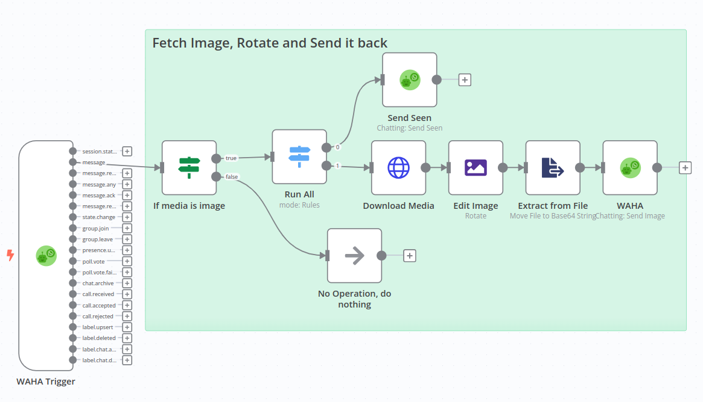

[<- Back](/)

# Fetch image, Rotate and Send it back

[**template.json**](./template.json)

## How it works
When receive image on WhatsApp session - **send seen** always and based on image:
- **Fetch** the image
- **Rotate** the image by 180 degrees
- **Send back** the rotated image

## Set up steps
- **Copy** template and **Paste** in n8n (Ctrl+V), or **Import From URL** 
- Configure **WAHA API** credentials and select it for all WAHA nodes
- Get **Webhook URL** (production one) from **WAHA Trigger** node
- Configure your **WAHA session** to send webhooks with `message` type to the **Webhook URL**
- **Active** your workflow in n8n
- Send image to the WhatsApp account from another one and see the magic!
