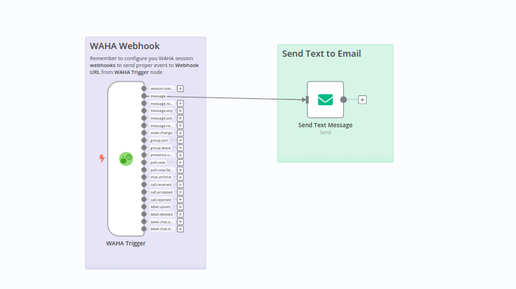

# Forward all text messages to email
[Template](./template.json)

Receive and forward all text messages to the email.

### How it works
Receive all text messages and forward them to the email.

### Set up steps
- **Copy** template and **Paste** in n8n (Ctrl+V), or **Import From URL** (remember to get **Raw** link from GitHub in [template](./template.json))
- Configure **WAHA API** credentials and select it for all WAHA nodes
- Configure **Email** node with your **from** and **to** email (requires **SMTP credentials** as well)
- **Active** your workflow in n8n
- Get **Webhook URL** (production one) from **WAHA Trigger** node
- Configure you **WAHA session** to send webhooks with `message` type to the **Webhook URL**
- Send any message
- and see the message in your email!
