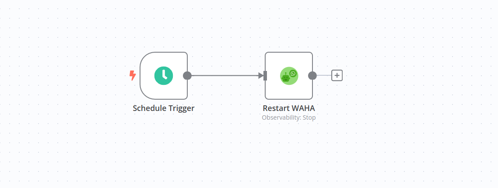

# Restart server at midnight
[Template](./template.json)

### How it works
When the time is midnight - it sends a `POST /api/server/stop` request to the 
WAHA API and docker container stops and then starts again.

### Set up steps
- **Copy** template and **Paste** in n8n (Ctrl+V), or **Import From URL** (remember to get **Raw** link from GitHub in [template](./template.json))
- Configure **WAHA API** credentials and select it for all WAHA nodes
- **Active** your workflow in n8n
- Enjoy the automation! 
