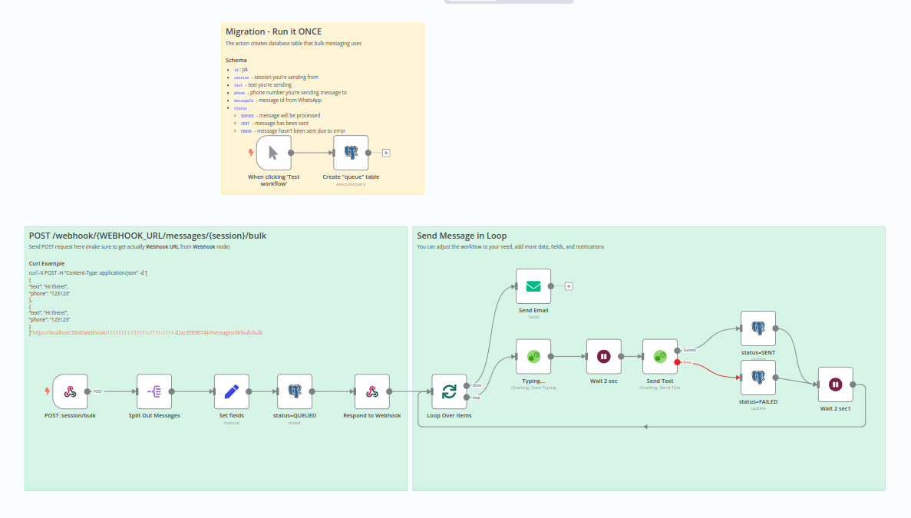

[<- Back](/)

# Send Bulk Messages API

[**template.json**](./template.json)



## How it works
Send bulk messages to the phone numbers and at the end send an email.

## Set up steps
- **Copy** template and **Paste** in n8n (Ctrl+V), or **Import From URL** 
- Configure **WAHA API** credentials and select it for all WAHA nodes
- Get **Webhook URL** (production one) from **WAHA Trigger** node
- Configure your **WAHA session** to send webhooks with `message` type to the **Webhook URL**
- Configure your **PostgresSQL** credentials and set it to all **PostgresSQL** nodes
- Configure your **SMTP** credentials and set it to the **Email** node
- **Run** once the migration
- **Active** your workflow in n8n
- Get **Webhook URL** from **Webhook** node

Send request to the endpoint with the following payload:

```bash
curl -X POST -H "Content-Type: application/json" -d '[
    {
        "text": "Hi there!",
        "phone": "123123"
    },
        {
        "text": "Hi there!",
        "phone": "123123"
    },
        {
        "text": "Hi there!",
        "phone": "123123"
    },
    {
        "text": "Hi there!",
        "phone": "123123"
    }
]' https://localhost:5000/webhook/11111111-111111-1111-1111-d2ac95896744/messages/{SESSION}/bulk
```

It'll send the message to the phone numbers and at the end send an email, 
and you can check database for the status of the messages.
