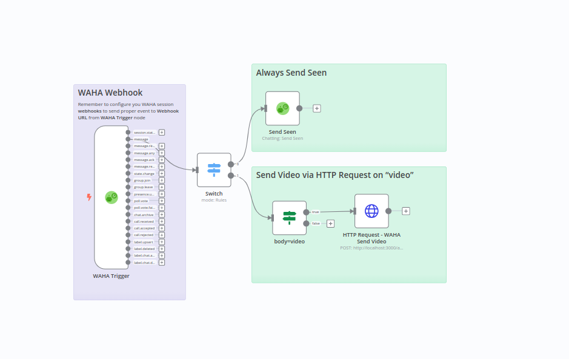

# Send Custom HTTP Request to WAHA API
[Template](https://raw.githubusercontent.com/devlikeapro/n8n-nodes-waha/master/n8n-workflows/send-custom-http-request-to-waha/template.json)

Template how to send custom HTTP request to WAHA API. It sends video message on incoming message with text "video".

### How it works
When receive a new message on WhatsApp session - send "video" message back (marking as seen the original message)

### Set up steps
- **Copy** template and **Paste** in n8n (Ctrl+V), or **Import From URL** (remember to get **Raw** link from GitHub in [template](./template.json))
- Configure **WAHA API** credentials and select it for all WAHA nodes
- **Active** your workflow in n8n
- Get **Webhook URL** (production one) from **WAHA Trigger** node
- Configure you **WAHA session** to send webhooks with `message` type to the **Webhook URL**
- Send "video" to the WhatsApp account from another one and see the magic!
