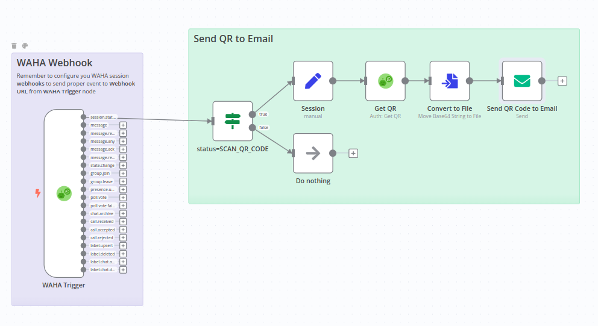

[<- Back](/)

# Send QR code for authorization to Email
[**template.json**](./template.json)

Send QR code to the email when session it's in `SCAN_QR_CODE` status.

### How it works
When session status is `SCAN_QR_CODE` - it fetches the QR code and sends it to the Email.

### Set up steps
- **Copy** template and **Paste** in n8n (Ctrl+V), or **Import From URL**
- Configure **WAHA API** credentials and select it for all WAHA nodes
- Configure **Email** node with your **from** and **to** email (requires **SMTP credentials** as well)
- **Active** your workflow in n8n
- Get **Webhook URL** (production one) from **WAHA Trigger** node
- Start a new session with **Webhook URL** configured for `session.status` event
- and see the QR code in your email!
