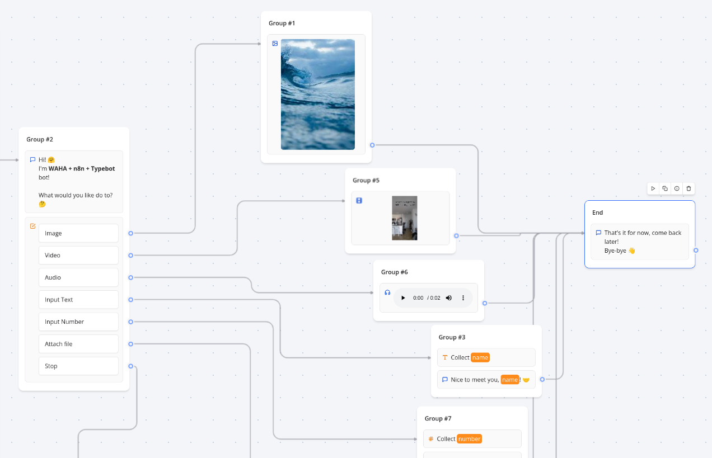
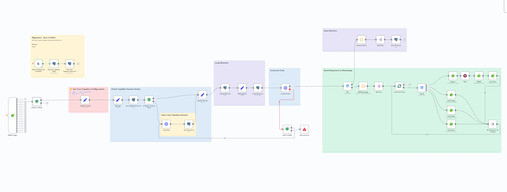

[<- Back](/)

# WhatsApp Typebot Integration

## Typebot Workflow
[**typebot.json**](./typebot.json)

## N8n Workflow
[**template.json**](./template.json)

## How it works
Integrate 
[Typebot](https://typebot.io/)
with 
[Self-Hosted WhatsApp API (WAHA)](https://waha.devlike.pro)
to send messages to WhatsApp via 
[n8n](https://n8n.io/).

## Set up steps
1. Import [typebot.json](./typebot.json) to **Typebot**
2. Copy [template.json](./template.json) and paste it in **n8n** (Ctrl+V), or import it from URL
3. Configure **WAHA API** credentials and select it for all WAHA nodes
4. Configure **Typebot** node with your `typebot.url` and `typebot.bot.id`
5. Configure **Postgres** nodes with your Postgres credentials
6. Run **Migration** block to create the necessary tables
7. Get **Webhook URL** (production one) from **WAHA Trigger** node
8. Configure your **WAHA session** to send webhooks with `message` type to the **Webhook URL**
9. **Active** your workflow in n8n

## Notes
### Buttons
For [Buttons](https://docs.typebot.io/editor/blocks/inputs/buttons) block in Typebot n8n allows you to answer 
with a simple number.

For example, if you have buttons:
1. Invoice
2. Payment

and want to select **Invoice** you can send both **1** and **Invoice** back to WhatsApp bot

### Input Files
You can use [Input Text](https://docs.typebot.io/editor/blocks/inputs/text#allow-attachments) 
Typebot block to allow attachments. 

Then you can send the file to the WhatsApp bot and process it in n8n or Typebot.

### Supported Typebot Blocks
#### Bubbles
- [x] Text
- [x] Image
- [x] Video
- [ ] Embed
- [x] Audio

#### Inputs
- [x] Text
- [x] Text + File attachment (one)
- [x] Number
- [x] Email
- [x] Website
- [x] Date
- [x] Phone
- [x] Buttons
- [ ] Pic choice
- [ ] Payment
- [ ] Rating
- [ ] File - **use `Text + File` input instead**
